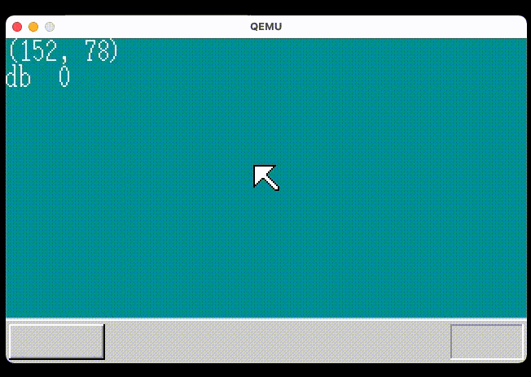

# Kitax
自作 32bit OS

書籍[30日でできる！ OS自作入門](https://book.mynavi.jp/supportsite/detail/4839919844.html)を元に作成したOS



2021/03/30 時点

## 環境

* 開発PC
    * Mac 10.15.6(Catalina)
* Docker
    * C 言語クロスコンパイル環境の構築に使用

## OS 起動方法

* 事前準備
    * C コンパイルするために docker コンテナの起動が必要
    * docker アプリケーションを起動する
    * `$ make start`
* OS のイメージファイルを作成
    * `$ make`
* OS の起動
    * `$ make run`
* 終わったら docker コンテナを削除する
    * `$ make stop`

## 開発ツール

Mac 向けの使用ツールについては以下の記事を参考

[『30日でできる！OS自作入門』を macOS Catalina で実行する](https://qiita.com/noanoa07/items/8828c37c2e286522c7ee)

### qemu

PC エミュレータ

バージョン

    $ qemu-system-x86_64 --version
    QEMU emulator version 5.1.0
    Copyright (c) 2003-2020 Fabrice Bellard and the QEMU Project developers

img ファイル(OS が書き込まれたファイル) を PC で起動するエミュレートコマンド

	$ qemu-system-x86_64 -drive file=kitax.img,format=raw -usb

マウスが消えた場合は ctrl+option+g でマウスをリリースできる

### NASM

アセンブラ言語

    $ nasm -v
    NASM version 2.15.04 compiled on Aug 22 2020

アセンブル

    $ nasm helloos.nas -o helloos.img

リストファイルを出力してアセンブル

    $ nasm ipl.nas -o ipl.bin -l ipl.lst

win32-COFF 形式のオブジェクトファイルとして出力する

    $ nasm naskfunc.nas -fwin32 -o naskfunc.obj

* `$`
    * 現在番地を表す
* `$$`
    * ORG の番地を表す

#### レジスタ

* 汎用？レジスタ
  * AX
    * アキュムレータ
    * 累積演算機という意味
  * CX
    * カウンタ
    * 数を数えるのに良い
  * DX
    * データ
  * BX
    * ベース
  * SP
    * スタックポインタ
  * BP
    * ベースポインタ
  * SI
    * ソースインデックス
  * DI
    * デスティネーションインデックス
* セグメントレジスタ
  * ES
    * エクストラセグメント
  * CS
    * コードセグメント
  * SS
    * スタックセグメント
  * DS
    * データセグメント
  * FS
    * 本名なし
  * GS
    * 本名なし

### Hex Fiend

バイナリエディタ

### mformat

ディスクイメージ作成ツール

本家の `edimg.exe` の代わり

install

    $ brew install mtools

実行

ディスクの先頭に ipl.bin を配置し 1440KB のイメージファイル
helloos.img を作成する

    $ mformat -f 1440 -C -B ipl.bin -i helloos.img ::

作成したイメージファイルに kitax.sys を保存して再度イメージファイルを作成

    $ mcopy -i kitax.img kitax.sys ::

### os.ld

OS 用リンカスクリプト

入手元は以下のサイト。情報ありがとうございます

[『30日でできる！OS自作入門』のメモ](https://vanya.jp.net/os/haribote.html)

haribote OS の実行形式にビルドするためのリンカスクリプトとなっている

### C コンパイル

調査した感じ catalina では 32bit 向けクロスコンパイルに必要なコンパイラ及びツール類を揃えることが難しい
そのため docker で ubuntu 環境のコンテナを作成しそこで 32bit コンパイルする対応とした

1. docker で ubuntu のリポジトリを入手する
    * `docker pull ubunntu:18.04`
1. 作成した ubuntu コンテナに `gcc` と `make` をインストールする
1. ubuntu コンテナのホームディレクトリに hrb.ld を置く
1. ここまでの環境の ubuntu コンテナから image を作成する
    * イメージ名 `ubuntu_for_xcomp` で作成
1. 一旦全てのコンテナを停止、削除する
1. `ubuntu_for_xcomp` イメージからコンテナ名 `work` を作成する
1. `make bootpack.hrb` を実行する
    1. make bootpack.hrb の内訳は以下
    1. work コンテナを start
    1. コンテナにコンパイル対象の `bootpack.c` を渡す
    1. `docker exec` コマンドで `bootpack.c` をコンパイル
    1. コンパイル結果をホスト環境に渡す
    1. work コンテナを stop

GCC のコマンドは以下を参考にさせていただきました。ありがとうございます

[『30日でできる！OS自作入門』を macOS Catalina で実行する](https://qiita.com/noanoa07/items/8828c37c2e286522c7ee)

	$ gcc -march=i486 -m32 -nostdlib -fno-pic -T hrb.ld -o bootpack.hrb bootpack.c

bootpack が位置独立実行形式(position independent cod)のためのシンボル `_GLOBAL_OFFSET_TABLE_` を
参照しようとするが不要なためオプション `-fno-pic` を追加した

#### docker コマンド覚書

* docker image からコンテナ作成＆起動
    * `docker run -it -d --name コンテナ名 イメージ:バージョン`
* コンテナをイメージにコミット
    * `docker commit コンテナ名 イメージ`
* 起動している ubuntu コンテナの bash を起動する
    * `docker exec -it コンテナ名 bash`

### hankaku

`hankaku.txt` の内容を C ソースにコンバートする perl スクリプト(hankaku2dat.pl)を作成して対応
以下のコマンドで `hankaku.txt` を変換した `hankaku.c` を出力する

    $ perl hankaku2dat.pl > hankaku.c

## USB ブート

USB フラッシュメモリでのブート方法をまとめる

ただし、OS のフラッシュメモリ作成には作業PCのドライブを誤って上書きしてしまう恐れがあるため
基本はエミュレータ上で実行する運用とした方がよい

* 参考にさせていただきました
    * [３０日OS自作入門　１３日目途中　USBから実機で起動できた](https://cgod-kei.blogspot.com/2018/09/osusb30os.html)
    * [参考GitHub](https://github.com/keita99/30dayOS/tree/master/day_13/harib10c)

### USB 用 IPL

IPL からの読み出し方法が USB とフロッピーでは異なるため ipl10.nas を変更する必要がある

### USB フラッシュメモリ作成方法

以下の手順で壊れても良い USB フラッシュメモリに OS のイメージファイルを書き込む

```
# USB の挿さっているディスクを確認する
diskutil list

# USB をアンマウントする
diskutil unMountDisk /dev/diskN

# USB フラッシュメモリにイメージファイルを書き込む
# dd の出力先間違えると PC のドライブを上書きする可能性があるため注意
sudo dd if=kitax.img of=/dev/diskN

```

### エミュレータ実行

USB フラッシュメモリ用のイメージファイルをエミュレータで実行する方法

```
qemu-system-x86_64 -usb kitax.img
```

## 設計

### 関数

#### mysprintf

簡易的な sprintf. 
フォーマット指定子は %d, %x のみ使用可能. 

## 覚書

### ブートセクタ

ディスクの最初のセクタ(512byte)がブートセクタとなる.
PC は始めにブートセクタを読み込み最後の 2byte が 0x55、0xAA かを確認する.
0x55、0xAA でない場合は有効なプログラムが書かれていないと判断しエラーとなる.


